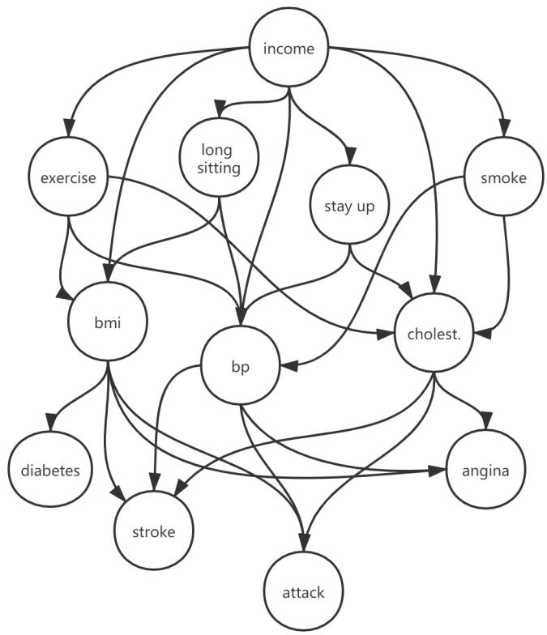
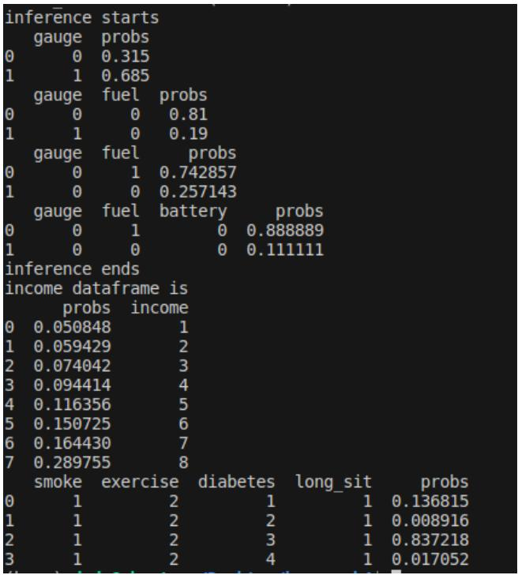

# AI 3603 Artificial Intelligence: Principles and Techniques Homework 3

Adhere to the Code of Academic Integrity. You may discuss background issues and general strategies with others and seek help from course staff, but the implementations that you submit must be your own. In particular, you may discuss general ideas with others but you may not work out the detailed solutions with others. It is never OK for you to see or hear another student's code and it is never OK to copy code from published/Internet sources. Moss (Measure Of Software Similarity) will be used for determining the similarity of programs to detect plagiarism in the class (https://theory.stanford.edu/~aiken/moss/). If you encounter some difficulties or feel that you cannot complete the assignment on your own, discuss with your classmates in Discussion forum on Canvas, or seek help from the course staff.

You are required to complete this homework **individually.** Please submit your assignment following the instructions summarized in Section 5.

---

## 1 Coding Part

In this assignment you will implement code for computing exact inferences in Bayesian networks of discrete random variables using variable elimination. Before you start coding, be sure to read the `PandaTutorial.pdf`. Then you can implement the code `BayesianNetworks.py`. Two functions are already written, `readFactorTable` and `readFactorTablefromData`, which build conditional probability tables, represented as factors. See the source file `BayesNetworkTestScript.py` for a demonstration of how these work. Your job is to implement the following functions. Please read the comments given in the codes carefully.

### Functions to Implement

- **`joinFactors(Factor1, Factor2)`**
  
  Should return a factor table that is the join of factor 1 and 2. You can assume that the join of two factors is a valid operation. 
  
  *Hint:* You can look up `pd.merge` for merging two dataframes.

- **`marginalizeFactor(factorTable, hiddenVar)`**
  
  This function should return a factor table that marginalizes `margVar` out of it. Assume that `hiddenVar` is on the left side of the conditional. 
  
  *Hint:* You can look up `pd.groupby`.

- **`marginalizeNetworkVariables(bayesNet, hiddenVar)`**
  
  This function takes a Bayesian network, `bayesNet`, and marginalizes out a list of variables `hiddenVar`.

- **`evidenceUpdateNet(bayesnet, evidenceVars, evidenceVals)`**
  
  This function takes a Bayesian network, `bayesNet`, and sets the list of variables, `evidenceVars`, to the corresponding list of values, `evidenceVals`. You do not need to normalize the factors to be proper probabilities (no need to sum to 1).

- **`inference(bayesnet, hiddenVar, evidenceVars, evidenceVals)`**
  
  This function takes in a Bayesian network and returns a single joint probability table resulting from the given set of evidence variables and marginalizing a set of hidden variables. You should normalize the table to give valid probabilities. The final table should be a proper probability table (entries sum to 1). The hidden variables shown in `hiddenVar` should not be in the returned table.

---

## 2 Written Part

In this part you will be analyzing risk factors for certain health problems (heart disease, stroke, heart attack, diabetes). The data is from the 2015 Behavioral Risk Factor Surveillance System (BRFSS) survey, which is run by the Centers for Disease Control (CDC). The distilled data is in the spreadsheet `RiskFactorData.csv`. The variables and their meanings are as follows:



**Figure 1: BRFSS Variables**

### Variable Descriptions

- **income** - Annual personal income level:
  - 1 (< $10,000)
  - 2 ($10,000 - $15,000)
  - 3 ($15,000 - $20,000)
  - 4 ($20,000 - $25,000)
  - 5 ($25,000 - $35,000)
  - 6 ($35,000 - $50,000)
  - 7 ($50,000 - $75,000)
  - 8 (> $75,000)

- **exercise** - Exercised in past 30 days: 1 (yes), 2 (no)
- **smoke** - Smoked 100 or more cigarettes in lifetime: 1 (yes), 2 (no)
- **long_sitting** - Sitting for more than 6 hours every day: 1 (yes), 2 (no)
- **stay_up** - Usually stay up late until 12pm: 1 (yes), 2 (no)
- **bmi** - Body mass index (category): 1 (underweight), 2 (normal), 3 (overweight), 4 (obese)
- **bp** - Has high blood pressure: 1 (yes), 2 (only when pregnant), 3 (no), 4 (pre-hypertensive)
- **cholesterol** - Has high cholesterol: 1 (yes), 2 (no)
- **angina** - Had heart disease (angina): 1 (yes), 2 (no)
- **stroke** - Had a stroke: 1 (yes), 2 (no)
- **attack** - Had a heart attack: 1 (yes), 2 (no)
- **diabetes** - Had diabetes: 1 (yes), 2 (only during pregnancy), 3 (no), 4 (pre-diabetic)

### Questions

Do the following, and write up your results in your homework submission files (to back up your claim, please provide screenshots of your program results).

1. **Network Structure and Size**
   
   Create the following Bayesian network to analyze the survey results. You will want to use the provided function `createCPTfromData`.
   
   - What is the size (in terms of the number of probabilities needed) of this network? 
   - Alternatively, what is the total number of probabilities needed to store the full joint distribution?

2. **Health Outcomes Analysis**
   
   For each of the four health outcomes (diabetes, stroke, heart attack, angina), answer the following by querying your network (using your `infer` function):
   
   (a) What is the probability of the outcome if I have bad habits (smoke, don't exercise, long sitting and stay up)? How about if I have good habits?
   
   (b) What is the probability of the outcome if I have poor health (high blood pressure, high cholesterol, and overweight)? What if I have good health (low blood pressure, low cholesterol, and normal weight)?

3. **Income Effect Analysis**
   
   Evaluate the effect a person's income has on their probability of having one of the four health outcomes (diabetes, stroke, heart attack, angina). For each of these four outcomes, plot their probability given income status (your horizontal axis should be $i = 1, 2, \ldots, 8$, and your vertical axis should be $P(y = 1 \mid \text{income} = i)$, where $y$ is the outcome). What can you conclude?

4. **Testing Independence Assumptions**
   
   Notice there are no links in the graph between the habits and the outcomes.
   
   - What assumption is this making about the effects of smoking and exercise on health problems? 
   - Let's test the validity of these assumptions. Create a second Bayesian network as above, but add edges from smoking to each of the four outcomes and edges from exercise to each of the four outcomes. 
   - Now redo the queries in Question 2. What was the effect, and do you think the assumptions of the first graph were valid or not?

5. **Outcome Interactions**
   
   Also notice there are no edges between the four outcomes. What assumption is this making about the interactions between health problems? Make a third network, starting from the network in Question 4, but adding an edge from diabetes to stroke. For both networks, evaluate the following probabilities:
   
   $$P(\text{stroke} = 1 \mid \text{diabetes} = 1) \quad \text{and} \quad P(\text{stroke} = 1 \mid \text{diabetes} = 3)$$
   
   Again, what was the effect, and was the assumption about the interaction between diabetes and stroke valid?

6. **Code Verification**
   
   Finally, make sure that your code runs correctly on all of the examples in `BayesNetworkTestScript.py`. You need to update `BayesianNetworks.py` to support your earlier written part. Your code will be graded for correctness on these also. To check correctness, a screen-shot of the output is shown as Figure 2.



**Figure 2: Expected Output**

---

## 3 Installation

You can follow the tutorial in this section to install the environment on Linux, Windows or macOS, and we recommend you to use Linux system.

### 3.1 Install Anaconda

1. Open the address https://www.anaconda.com/distribution/
2. Download the installer of Python 3.x version (3.8 recommended) for your system

### 3.2 Install Required Environment

After installing anaconda, open a terminal and create an environment for this homework:

```bash
conda create python=3.8 --name bayes
```

Then activate the environment:

```bash
conda activate bayes
```

Install some dependencies:

```bash
pip install numpy pandas
```

---

## 4 Discussion and Question

You are encouraged to discuss your ideas, ask and answer questions about this homework. If you encounter any difficulty with the assignment, try to post your problem on Canvas for help. The classmates and the course staff will try to reply.

---

## 5 Submission Instructions

1. Zip all your program files, experiment result, and report file `HW3_report.pdf` to a file named as `HW3_ID_name.zip`.
2. Upload the file to the homework 3 page on the Canvas.
3. **Deadline: 2025.11.30 23:59**